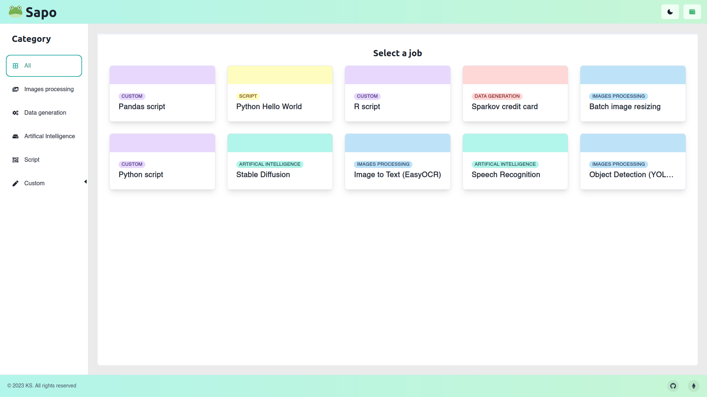

# Sapo-FEVM
Sapo is a decentralized cloud computing platform that leverages the Filecoin EVM and Bacalhau compute over data ecosystem. Made during ETHGlobal Hackaton

## Discover
- The repo of the project: [Here](https://github.com/julio4/sapo-fevm)
- EthGlobal page: [Here](https://ethglobal.com/showcase/sapo-wtdhn)
- Static Website (backend might not be running): [Here](https://sapo-sage.vercel.app/app)

